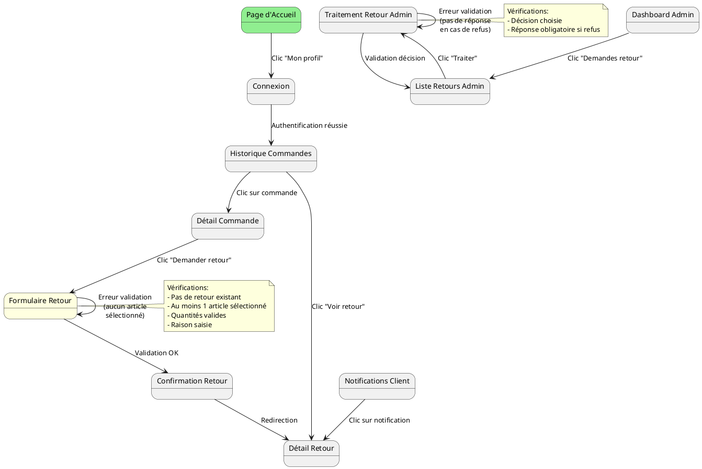
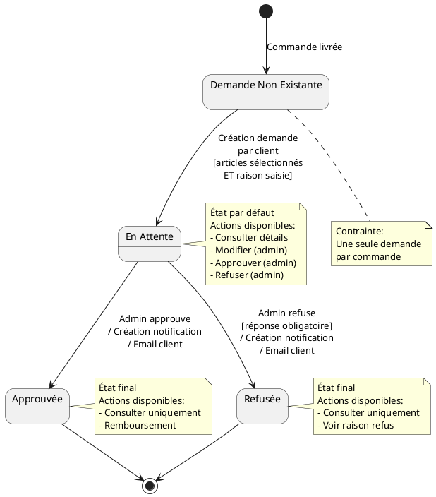
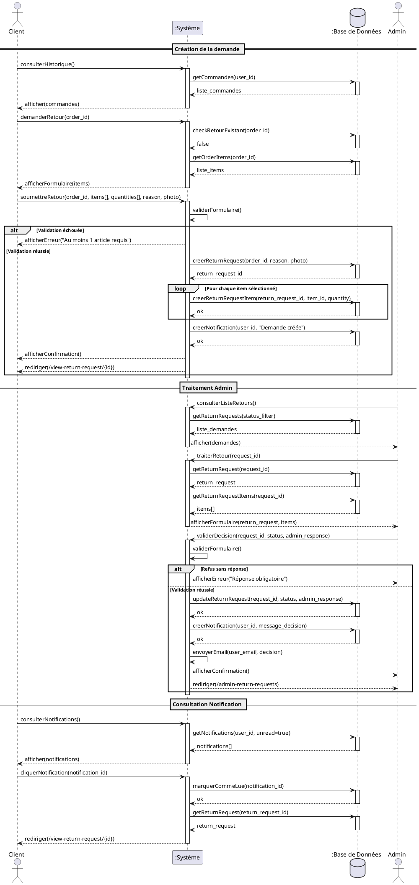
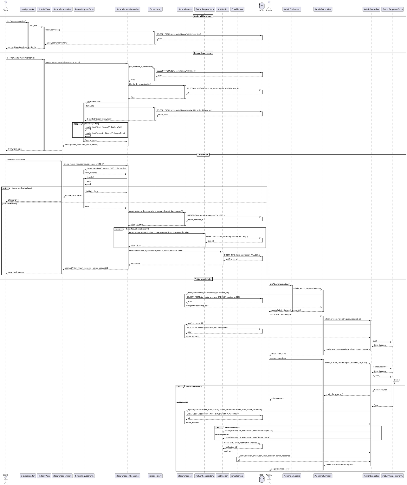

# MedinaChic - Fonctionnalités et Diagrammes Dynamiques

## 📋 LISTE COMPLÈTE DES FONCTIONNALITÉS

### 🛍️ Module Boutique (Store)

#### 1. Gestion des Produits
- **Consultation du catalogue** : Affichage de tous les produits avec images, prix, descriptions (FR/NL)
- **Recherche de produits** : Recherche par nom, description, catégorie
- **Filtrage par catégorie** : 8 catégories (accessoire, alimentaire, argile, cuisine, maroquinerie, tissu, vêtement, autre)
- **Détail produit** : Vue détaillée avec description, prix, stock disponible, avis clients
- **Multilingue** : Support Français/Néerlandais pour tous les produits

#### 2. Gestion du Panier
- **Ajout au panier** : Ajout de produits avec vérification du stock
- **Modification des quantités** : Ajustement en temps réel des quantités
- **Réservation de stock** : Réservation temporaire (15 min) lors de l'ajout au panier
- **Nettoyage automatique** : Libération des réservations expirées
- **Suppression du panier** : Vidage complet du panier
- **Validation du stock** : Vérification continue de la disponibilité

#### 3. Système de Commande
- **Paiement Stripe** : Intégration complète avec Stripe Checkout
- **Création de session de paiement** : Génération sécurisée des sessions
- **Webhook Stripe** : Gestion des événements de paiement (succès/échec)
- **Historique des commandes** : Conservation de toutes les commandes passées
- **Génération de factures PDF** : Création automatique de factures avec ReportLab
- **Envoi email de factures** : Envoi automatique par email après paiement

#### 4. Système d'Avis Clients (Reviews)
- **Ajout d'avis** : Note de 1 à 5 étoiles + titre + commentaire
- **Achat vérifié** : Badge "Achat vérifié" pour les clients ayant commandé
- **Modification/Suppression** : Gestion de ses propres avis
- **Calcul de moyenne** : Note moyenne affichée sur chaque produit
- **Distribution des notes** : Statistiques par nombre d'étoiles
- **Affichage chronologique** : Avis triés du plus récent au plus ancien

#### 5. Système de Retours
- **Demande de retour** : Création de demande avec raison et photo optionnelle
- **Sélection d'articles** : Choix des produits spécifiques à retourner dans une commande
- **Choix de quantités** : Sélection de la quantité à retourner par produit
- **Validation admin** : Interface admin pour approuver/refuser les retours
- **Réponse personnalisée** : Message de l'admin au client
- **Calcul du montant** : Calcul automatique du montant à rembourser
- **Statuts multiples** : Pending, Approved, Rejected
- **Restrictions** : Impossible de faire plusieurs demandes pour une même commande

#### 6. Système de Notifications
- **Notifications utilisateur** : Alertes pour les décisions de retour
- **Badge de notifications** : Compteur dans la navbar
- **Marquage lu/non lu** : Gestion de l'état de lecture
- **Types de notifications** : Retours, alertes de stock, statut de commande
- **Historique** : Conservation de toutes les notifications

#### 7. Alertes de Stock
- **Abonnement aux alertes** : S'inscrire pour être notifié du retour en stock
- **Notification automatique** : Email envoyé lors du réapprovisionnement
- **Vérification périodique** : Système de check des produits réapprovisionnés
- **Désabonnement automatique** : Après notification

### 👤 Module Comptes (Accounts)

#### 8. Gestion des Utilisateurs
- **Inscription** : Création de compte avec email unique
- **Connexion/Déconnexion** : Authentification sécurisée
- **Profil utilisateur** : Consultation et modification des informations
- **Suppression de compte** : Soft delete avec conservation de l'historique
- **Gestion des adresses** : CRUD complet des adresses de livraison
- **Adresse par défaut** : Définition d'une adresse principale
- **Intégration Stripe Customer** : Création automatique de clients Stripe

### 📝 Module Blog

#### 9. Système de Blog
- **Création d'articles** : Tout utilisateur peut publier des articles
- **Multilingue** : Titre et contenu en FR/NL
- **Images** : Upload d'images pour les articles
- **Slug automatique** : Génération de slugs uniques
- **Activation/Désactivation** : Contrôle de la visibilité des articles
- **Suppression** : Seul l'auteur peut supprimer son article

#### 10. Commentaires Blog
- **Ajout de commentaires** : Commentaires sur les articles
- **Modération** : Activation/désactivation par l'auteur
- **Affichage chronologique** : Ordre des commentaires

#### 11. Messagerie Privée
- **Conversations** : Messagerie entre utilisateurs
- **Liste des conversations** : Vue d'ensemble des échanges
- **Recherche d'utilisateurs** : Trouver des utilisateurs pour discuter
- **Envoi de messages** : Messages en temps réel
- **Statut lu/non lu** : Indication de lecture des messages
- **Dernière activité** : Tri par dernier message

### 🔧 Module Administration

#### 12. Dashboard Admin
- **Tableau de bord** : Vue d'ensemble des statistiques
- **Gestion des produits** : CRUD complet via l'interface admin
- **Gestion du stock** : Mise à jour des quantités
- **Statistiques de vente** : Rapports de ventes
- **Liste des demandes de retour** : Vue centralisée avec filtres
- **Traitement des retours** : Interface dédiée pour approuver/refuser

### 🌐 Fonctionnalités Transversales

#### 13. Multilingue
- Support complet Français/Néerlandais
- URLs localisées (FR et /nl/)
- Templates dupliqués pour chaque langue

#### 14. API REST
- **API Produits** : Endpoint REST pour les produits
- **API Inscription** : Endpoint pour création de comptes
- **Serializers** : Transformation JSON des données

#### 15. Sécurité
- **Authentification requise** : @login_required sur les fonctions sensibles
- **Protection CSRF** : Tokens sur tous les formulaires
- **Webhooks sécurisés** : Vérification des signatures Stripe
- **Validation des données** : Formulaires Django avec validation

---

## 🎯 SCÉNARIO MÉTIER : Demande de Retour Partiel d'une Commande

**Cas d'utilisation** : Un client souhaite retourner certains articles d'une commande multi-produits

### Scénario Nominal

**Acteur principal** : Client authentifié  
**Préconditions** : 
- Le client est connecté
- Le client a passé une commande avec plusieurs articles
- La commande a été livrée

**Flux principal** :
1. Le client accède à l'historique de ses commandes
2. Le système affiche la liste des commandes avec détails
3. Le client sélectionne une commande et clique sur "Demander un retour"
4. Le système vérifie qu'aucun retour n'est en cours pour cette commande
5. Le système affiche la liste des articles de la commande avec checkboxes
6. Le client sélectionne les articles à retourner
7. Le client ajuste les quantités à retourner pour chaque article
8. Le client saisit la raison du retour
9. Le client ajoute une photo (optionnel)
10. Le client valide la demande
11. Le système crée la demande de retour avec statut "En attente"
12. Le système crée une notification pour informer de la prise en compte
13. Le système affiche un message de confirmation
14. L'admin reçoit la nouvelle demande dans son dashboard
15. L'admin consulte la demande avec tous les détails
16. L'admin approuve la demande
17. Le système change le statut à "Approuvée"
18. Le système crée une notification pour le client
19. Le client reçoit une notification d'approbation
20. Fin du cas d'utilisation

### Scénario Alternatif 1 : Refus de la demande

**Divergence au point 16** :
16a. L'admin refuse la demande
16b. L'admin saisit une explication du refus
16c. Le système change le statut à "Refusée"
16d. Le système crée une notification avec la raison du refus
16e. Le client reçoit la notification de refus
16f. Fin du cas d'utilisation

### Scénario Alternatif 2 : Retour déjà en cours

**Divergence au point 4** :
4a. Le système détecte qu'un retour existe déjà pour cette commande
4b. Le système affiche un message d'erreur
4c. Le système redirige vers l'historique des commandes
4d. Fin du cas d'utilisation

### Cas d'Erreur 1 : Aucun article sélectionné

**Divergence au point 10** :
10a. Le client valide sans sélectionner d'articles
10b. Le système détecte l'erreur de validation
10c. Le système affiche un message d'erreur "Veuillez sélectionner au moins un article"
10d. Le système reste sur le formulaire
10e. Retour au point 6

### Cas d'Erreur 2 : Quantité invalide

**Divergence au point 7** :
7a. Le client saisit une quantité supérieure à celle commandée
7b. JavaScript bloque la saisie (max = quantité commandée)
7c. Retour au point 7

### Cas d'Erreur 3 : Photo trop volumineuse

**Divergence au point 9** :
9a. Le client tente d'ajouter une photo > 5MB
9b. Le système détecte l'erreur
9c. Le système affiche un message d'erreur
9d. Le client doit réduire la taille ou choisir une autre photo
9e. Retour au point 9

---

## 📊 DIAGRAMMES DYNAMIQUES

### 1. Diagramme de Navigation



### 2. Diagramme d'État-Transition



### 3. Diagramme d'Activité

```plantuml
@startuml
start

:Client accède à\nHistorique Commandes;

:Système affiche liste\ndes commandes;

:Client sélectionne\nune commande;

:Client clique\n"Demander retour";

if (Retour existe déjà?) then (oui)
  :Afficher message erreur;
  :Rediriger vers historique;
  stop
else (non)
  :Afficher formulaire\navec liste articles;
endif

partition "Sélection Articles" {
  repeat
    :Client coche un article;
    :Client ajuste quantité;
  repeat while (Autres articles?) is (oui)
  ->non;
}

:Client saisit raison;

if (Photo à ajouter?) then (oui)
  :Client upload photo;
  if (Taille photo > 5MB?) then (oui)
    :Afficher erreur;
    stop
  endif
endif

:Client valide formulaire;

if (Au moins 1 article\nsélectionné?) then (non)
  :Afficher erreur validation;
  :Rester sur formulaire;
  stop
else (oui)
  :Créer demande retour\n(status = pending);
  
  fork
    :Créer ReturnRequestItems\npour chaque article;
  fork again
    :Créer notification\npour client;
  fork again
    :Enregistrer photo\nsi présente;
  end fork
  
  :Afficher confirmation;
  
  :Rediriger vers\ndétail retour;
endif

' Partie Admin
|Admin|

:Admin accède\nDashboard;

:Admin clique\n"Demandes retour";

:Système affiche\nliste avec filtres;

:Admin sélectionne\nune demande;

:Système affiche\ndétail complet;

if (Décision admin?) then (Approuver)
  :Admin clique Approuver;
  :Admin saisit réponse\n(optionnelle);
else (Refuser)
  :Admin clique Refuser;
  :Admin saisit réponse\n(obligatoire);
  
  if (Réponse saisie?) then (non)
    :Afficher erreur validation;
    stop
  endif
endif

:Valider formulaire;

fork
  :Changer status;
fork again
  :Sauvegarder réponse admin;
fork again
  :Créer notification client;
fork again
  :Envoyer email client;
end fork

:Rediriger vers\nliste demandes;

stop

@enduml
```

### 4. Diagramme de Séquence Système



### 5. Diagramme de Communication

```plantuml
@startuml
object ":Client" as client
object ":Vue\nHistorique" as vue_hist
object ":Vue\nFormulaireRetour" as vue_form
object ":Controleur\nRetour" as ctrl_retour
object ":Modele\nReturnRequest" as model_return
object ":Modele\nReturnRequestItem" as model_item
object ":Modele\nNotification" as model_notif
object ":Modele\nOrderHistory" as model_order
object ":Modele\nOrderHistoryItem" as model_order_item
object ":Service\nEmail" as service_email
object ":Vue\nAdminTraitement" as vue_admin
object ":Controleur\nAdmin" as ctrl_admin

client -> vue_hist : 1: consulterHistorique()
vue_hist -> model_order : 2: getCommandes(user_id)
vue_hist <-- model_order : 3: liste_commandes

client -> vue_form : 4: demanderRetour(order_id)
vue_form -> ctrl_retour : 5: verifierRetourExistant(order_id)
ctrl_retour -> model_return : 6: filter(order_id)
ctrl_retour <-- model_return : 7: exists=false
vue_form -> model_order_item : 8: getItems(order_id)
vue_form <-- model_order_item : 9: liste_items

client -> ctrl_retour : 10: soumettreRetour(data)
ctrl_retour -> ctrl_retour : 11: validerFormulaire()

alt Validation OK
    ctrl_retour -> model_return : 12: create(order_id, reason, photo)
    ctrl_retour <-- model_return : 13: return_request_id
    
    loop Pour chaque item
        ctrl_retour -> model_item : 14: create(return_request_id, item_id, qty)
        ctrl_retour <-- model_item : 15: ok
    end
    
    ctrl_retour -> model_notif : 16: create(user_id, "Demande créée")
    ctrl_retour <-- model_notif : 17: ok
    
    client <-- ctrl_retour : 18: confirmation
else Validation échouée
    client <-- ctrl_retour : 19: erreur
end

' Partie Admin
vue_admin -> ctrl_admin : 20: consulterListeRetours()
ctrl_admin -> model_return : 21: filter(status)
ctrl_admin <-- model_return : 22: liste_demandes
vue_admin <-- ctrl_admin : 23: demandes

vue_admin -> ctrl_admin : 24: traiterRetour(request_id)
ctrl_admin -> model_return : 25: get(request_id)
ctrl_admin <-- model_return : 26: return_request
ctrl_admin -> model_item : 27: filter(return_request_id)
ctrl_admin <-- model_item : 28: items[]
vue_admin <-- ctrl_admin : 29: donnees_formulaire

vue_admin -> ctrl_admin : 30: validerDecision(request_id, status, response)
ctrl_admin -> ctrl_admin : 31: validerFormulaire()

alt Validation OK
    ctrl_admin -> model_return : 32: update(request_id, status, response)
    ctrl_admin <-- model_return : 33: ok
    
    ctrl_admin -> model_notif : 34: create(user_id, message_decision)
    ctrl_admin <-- model_notif : 35: ok
    
    ctrl_admin -> service_email : 36: envoyerEmail(user_email, decision)
    ctrl_admin <-- service_email : 37: ok
    
    vue_admin <-- ctrl_admin : 38: confirmation
else Validation échouée
    vue_admin <-- ctrl_admin : 39: erreur
end

@enduml
```

### 6. Diagramme d'Interaction (Séquence Détaillé)



---

## 🎨 DESIGN PATTERNS ADOPTÉS

### 1. **Model-View-Template (MVT)** - Architecture Django
**Contexte** : Pattern principal de Django, variation du MVC

**Implémentation** :
- **Model** : `store/models.py`, `accounts/models.py`, `blog/models.py`
  - Classes : Product, Order, Cart, ReturnRequest, Shopper, BlogPost, etc.
  - Encapsulation de la logique métier et accès aux données
  
- **View** : `store/views.py`, `accounts/views.py`, `blog/views.py`
  - Fonctions : `create_return_request()`, `admin_process_return()`, etc.
  - Logique de contrôle et orchestration
  
- **Template** : `templates/store/*.html`, `templates/accounts/*.html`
  - Présentation HTML avec Django Template Language
  - Séparation stricte présentation/logique

**Avantages** :
- Séparation claire des responsabilités
- Réutilisabilité des composants
- Testabilité améliorée

### 2. **Active Record Pattern**
**Contexte** : Pattern intégré dans Django ORM

**Implémentation** :
```python
class Product(models.Model):
    name = models.CharField(max_length=128)
    quantity = models.IntegerField(default=0)
    
    def get_available_quantity(self):
        # Logique métier dans le modèle
        reserved = Order.objects.filter(
            product=self,
            ordered=False,
            reserved_until__gt=timezone.now()
        ).aggregate(total=Sum('quantity'))['total'] or 0
        return self.quantity - reserved
```

**Avantages** :
- Encapsulation de la logique métier avec les données
- API intuitive pour manipuler les objets
- Méthodes métier accessibles directement sur les instances

### 3. **Repository Pattern (implicite via QuerySets)**
**Contexte** : Abstraction de l'accès aux données

**Implémentation** :
```python
# Dans views.py
orders = Order.objects.filter(user=request.user, ordered=False)
return_requests = ReturnRequest.objects.filter(
    order=order, 
    status='pending'
).exists()
```

**Avantages** :
- Abstraction de la couche de persistance
- Requêtes réutilisables et chainables
- Facilite les tests (mock des QuerySets)

### 4. **Strategy Pattern**
**Contexte** : Différentes stratégies de traitement selon le statut

**Implémentation** :
```python
class ReturnRequest(models.Model):
    STATUS_CHOICES = [
        ('pending', 'En attente'),
        ('approved', 'Approuvée'),
        ('rejected', 'Refusée'),
    ]
    
    # Stratégies différentes selon le statut
    def process_approval(self):
        self.status = 'approved'
        self.create_notification('Retour approuvé')
        self.send_approval_email()
    
    def process_rejection(self, reason):
        self.status = 'rejected'
        self.admin_response = reason
        self.create_notification('Retour refusé')
        self.send_rejection_email()
```

**Avantages** :
- Flexibilité dans le traitement
- Ajout facile de nouveaux statuts
- Code plus maintenable

### 5. **Factory Pattern**
**Contexte** : Création d'objets complexes

**Implémentation** :
```python
# Dans ReturnRequestForm.__init__()
def __init__(self, *args, order=None, **kwargs):
    super().__init__(*args, **kwargs)
    if order:
        for item in order.items.all():
            # Factory de champs dynamiques
            self.fields[f'item_{item.id}'] = forms.BooleanField(
                required=False,
                initial=True,
                label=item.product_name
            )
            self.fields[f'quantity_{item.id}'] = forms.IntegerField(
                required=False,
                initial=item.quantity,
                min_value=1,
                max_value=item.quantity
            )
```

**Avantages** :
- Création dynamique de formulaires
- Encapsulation de la logique de création
- Flexibilité selon le contexte

### 6. **Observer Pattern**
**Contexte** : Notifications lors de changements d'état

**Implémentation** :
```python
# Quand un retour est traité
def admin_process_return(request, request_id):
    # ... traitement ...
    
    # Notification de l'observateur (client)
    Notification.objects.create(
        user=return_request.user,
        notification_type='return_approved',
        title='Votre demande a été traitée',
        message=f'...',
        related_return_request=return_request
    )
    
    # Email de notification
    send_email(return_request.user.email, decision)
```

**Avantages** :
- Couplage faible entre objets
- Système de notifications extensible
- Réactivité aux changements d'état

### 7. **Decorator Pattern**
**Contexte** : Ajout de comportements aux vues

**Implémentation** :
```python
@login_required
@require_http_methods(["GET", "POST"])
def create_return_request(request, order_id):
    # Vue protégée par décorateurs
    pass

@csrf_exempt
@require_POST
def stripe_webhook(request):
    # Webhook exempt de CSRF
    pass
```

**Avantages** :
- Ajout de fonctionnalités sans modifier le code
- Réutilisabilité des décorateurs
- Code plus lisible et maintenable

### 8. **Template Method Pattern**
**Contexte** : Structure commune avec variations

**Implémentation** :
```python
# Base template avec blocks



    <!-- Contenu spécifique -->


# Templates FR et NL partagent la structure
# return_request_form.html
# return_request_form_nl.html
```

**Avantages** :
- Réutilisation de la structure HTML
- Variations localisées dans les blocks
- Maintenance simplifiée

### 9. **Singleton Pattern (implicite)**
**Contexte** : Instance unique de configuration

**Implémentation** :
```python
# settings.py
STRIPE_API_KEY = config('STRIPE_API_KEY')

# Utilisé partout dans l'application
stripe.api_key = settings.STRIPE_API_KEY
```

**Avantages** :
- Configuration centralisée
- Une seule source de vérité
- Évite les duplications

### 10. **Facade Pattern**
**Contexte** : Simplification d'interfaces complexes

**Implémentation** :
```python
class Shopper(AbstractUser):
    def add_to_cart(self, slug):
        # Facade simplifiant l'ajout au panier
        product = get_object_or_404(Product, slug=slug)
        cart, _ = Cart.objects.get_or_create(user=self)
        order, created = Order.objects.get_or_create(
            user=self, 
            ordered=False, 
            product=product
        )
        
        if created:
            cart.orders.add(order)
        else:
            order.quantity += 1
            order.save()
        
        return cart
```

**Avantages** :
- Interface simplifiée pour opérations complexes
- Encapsulation de la complexité
- API plus intuitive

### 11. **State Pattern**
**Contexte** : Comportement selon l'état d'un objet

**Implémentation** :
```python
class ReturnRequest(models.Model):
    def can_be_modified(self):
        return self.status == 'pending'
    
    def can_be_deleted(self):
        return self.status == 'pending'
    
    def requires_admin_response(self):
        return self.status == 'rejected'
```

**Avantages** :
- Comportement adapté à l'état
- Code plus clair et prévisible
- Évite les conditions complexes

### 12. **Chain of Responsibility**
**Contexte** : Validation en cascade

**Implémentation** :
```python
class ReturnRequestForm(forms.Form):
    def clean(self):
        cleaned_data = super().clean()
        
        # Chaîne de validations
        if not self._has_selected_items(cleaned_data):
            raise ValidationError("Au moins un article requis")
        
        if not self._validate_quantities(cleaned_data):
            raise ValidationError("Quantités invalides")
        
        if not self._validate_reason(cleaned_data):
            raise ValidationError("Raison requise")
        
        return cleaned_data
```

**Avantages** :
- Validations modulaires et ordonnées
- Ajout facile de nouvelles validations
- Séparation des responsabilités

---

## 📈 RÉSUMÉ DES PATTERNS PAR CATÉGORIE

### Patterns Structurels
1. **MVT (MVC)** - Architecture globale
2. **Facade** - Simplification d'interfaces (`add_to_cart`)
3. **Decorator** - Ajout de comportements (`@login_required`)

### Patterns Créationnels
4. **Factory** - Création de formulaires dynamiques
5. **Singleton** - Configuration unique (settings)

### Patterns Comportementaux
6. **Active Record** - ORM Django
7. **Observer** - Système de notifications
8. **Strategy** - Traitement selon statut
9. **Template Method** - Templates Django
10. **State** - Comportement selon état
11. **Chain of Responsibility** - Validations en cascade
12. **Repository** - Abstraction des données (QuerySets)

---

## 🎯 MÉTRIQUES DU PROJET

- **Nombre total de fonctionnalités** : 48+
- **Nombre de modèles** : 17
- **Nombre de vues** : 60+
- **Support multilingue** : 2 langues (FR/NL)
- **Design patterns identifiés** : 12
- **Lignes de code (estimation)** : 10,000+

---

*Document généré le 2 décembre 2025 pour le projet MedinaChic E-commerce*
